<!--
  The card below (assets/card.svg) is GENERATED - do not hand-edit it.
  To change its text, colours or the moon, edit INFO / THEME in make_card.py
  and run:  python make_card.py
  The GitHub Action in .github/workflows/update-readme.yml re-renders it with
  live stats every 12 hours.
-->

<!--
  Generated (assets/tech-stack.svg) - do not hand-edit. Edit STACK in
  make_stack.py and run:  python make_stack.py
  The panel draws its own "Tech Stack" title, so there is no markdown heading.
  Logos come from Simple Icons and are cached in assets/icons.json.
-->

<!--
  Generated (assets/github-stats.svg) - do not hand-edit. Replaces the four
  third-party widgets this README used to embed (github-readme-stats,
  top-langs, streak-stats, activity-graph); two of them had started returning
  HTTP 402, and all four were points of failure outside our control.
  The panel draws its own title. Rendered by make_stats.py from the same
  assets/stats.json the card uses, so the numbers can never disagree.
-->

---

